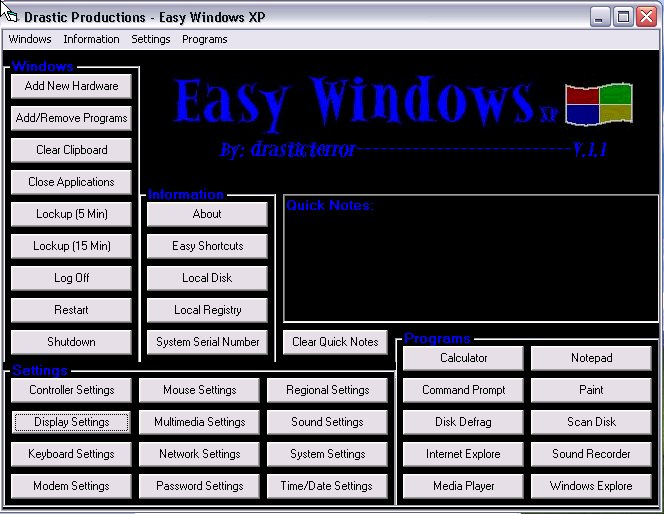



## Easy Windows XP v\.1\.1

### Description

Easy Windows XP v.1.1 is a program made to provide users a easy onscreen menu without having to browse throw directories. v.1.1 includes 12 settings quick launch setting buttons, 10 quick launch windows buttons, 5 quick launch information buttons, 10 quick launch program buttons, 12 keyboard shortcuts, and a onscreen quick notes and reminder field. Please vote for me, this is my first submission to PSC, if this gets good votes,I start on v.2.1 which i already have plans for! HINT: when using the Lockup (5 and 15min) feature, the system will compeletly lock up for that ammount of time, it doesnt harm the computer, i just felt you should know that so you dont freak out over it. PLEASE VOTE, GOOD VOTES=V.2.1! Also Easy Windows XP was built on and for WinXP, so if your running a different OS, i cant guarantee stability, full features, or anything else.
 
### More Info
 
multiple features

nuthing a simple exe, i will realese the source code when i realese v.2.1

The lockup modes (5min and 15min) completely lockup the system for that period of time, this isnt really a side effect, but i feel as if it should be known

             |
---                |---
**Submitted On**   |2002-11-30 21:19:46
**By**             |[bryan vincent](https://github.com/Planet-Source-Code/PSCIndex/blob/master/ByAuthor/bryan-vincent.md)
**Level**          |Beginner
**User Rating**    |4.3 (26 globes from 6 users)
**Compatibility**  |VB 6\.0
**Category**       |[Windows System Services](https://github.com/Planet-Source-Code/PSCIndex/blob/master/ByCategory/windows-system-services__1-35.md)
**World**          |[Visual Basic](https://github.com/Planet-Source-Code/PSCIndex/blob/master/ByWorld/visual-basic.md)
**Archive File**   |[Easy\_Windo1505651212002\.zip](https://github.com/Planet-Source-Code/bryan-vincent-easy-windows-xp-v-1-1__1-41147/archive/master.zip)

